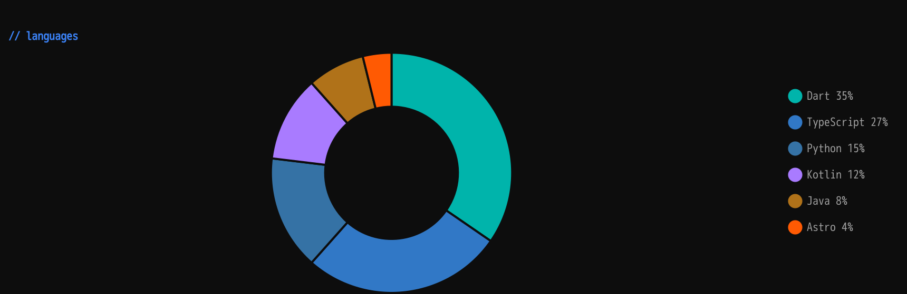
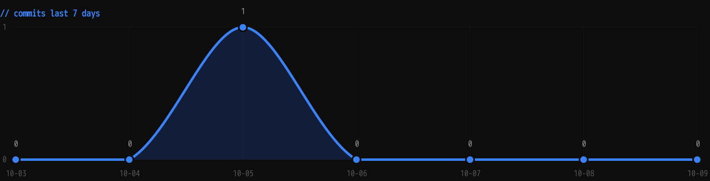

<!-- readme:stats:start -->
  
<!-- readme:stats:end -->

---

# **Carlos Sánchez Recio** · FullStack & Mobile Engineer

|  |  |
| --- | --- |
| 💼 **Contract** | 🟢 **Principal Developer** @Volone |
| 🤝 **Freelance** | 🔴 **CLOSED** |
| 🔭 **Building** | [Hestia](https://github.com/CharlyMech/hestia) — Personal app [CodeShamer](https://github.com/CharlyMech/code-shamer) — VS Code extension |
| 🌱 **Learning Myself** | Jetpack Compose & KMP · Swift & SwiftUI · Go lang |
| 🌲 **Learning Courses/Certifications** | GitHub Actions & CI/CD · AWS |
| 💬 **Ask me** | `Mobile development` · `Star Wars` · `Mechanical keyboards` |
| ⚡ **Fun fact** | I hated JavaScript for a long time — now I ship it daily 😶 |

## <!-- | ✍️ **Writing** | [Medium](https://medium.com/@CharlyMech) | -->

## `// STACK`

<code>// MOBILE</code>

 

       

<code>// FRONT-END</code>

 

       

<code>// BACK-END</code>

 

      

<code>// DATABASES</code>

 

       

<code>// DATA & AI</code>

 

         

<code>// CLOUD</code>

 

 

<code>// DEVOPS & CI/CD</code>

 

 

<code>// TOOLS & SYSTEMS</code>

 

   

---

## `// LOGS`

  

  <!-- readme:languages:start -->
  <picture>
    <source media="(prefers-color-scheme: dark)"  srcset="./assets/pie-dark.svg">
    <source media="(prefers-color-scheme: light)" srcset="./assets/pie-light.svg">
    
  </picture>
  <!-- readme:languages:end -->
  

  

  <!-- readme:activity:start -->
<picture>
  <source media="(prefers-color-scheme: dark)"  srcset="./assets/commits-7d-dark.svg">
  <source media="(prefers-color-scheme: light)" srcset="./assets/commits-7d-light.svg">
  
</picture>
<!-- readme:activity:end -->
  

---

## `// GEAR`

### 💻 Laptops

**MacBook Pro 14" (Main)**

- **CPU**: Apple M5 Pro
- **RAM**: 24 GB
- **SSD**: 1 TB
- **OS**: macOS Tahoe 26.5.1

<!-- **PCSpecialist Lafité Pro 14" (Secondary)**

- **CPU**: Intel Core i5-1240P
- **RAM**: 32 GB (upgraded)
- **SSD**: 1 TB Samsung 980 Pro
- **OS**: Windows 11
-->

### 🖱️ Mice

- Logitech MX Master 3
- Apple Magic Trackpad / MacBook Pro trackpad

<!-- ### ⌨️ Keyboards

- Odin75 · Tecsee Purples (lubed Tribosys 3203)
- Nextime75 · Ajazz & Huano Bananas (Krytox 205g0, double-step 57.5g springs)
- DZ60 · Gateron Milky Yellows (Krytox 205g0, 62.5g springs)
- MacBook Pro built-in (surprisingly good 🫣)

### 📱 Debug Phones

- Samsung Galaxy S23 (Android 14)
- iPhone 13 (iOS 17) -->

<!--### 🔧 Other

- HP OMEN 27q 27" QHD 2560 x 1440@165Hz monitor
-->
---

## `// CONTACT`

  

