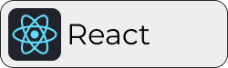

  
  
  
  

# Hello world!

#### My name is Carlos and I am a FullStack and Mobile software developer from Spain.

<!-- -  💼 Currently working at: **[Company Name]** as a **[Job Title]** -->

-  🤝 Available for: **Full time jobs** and **Freelance projects**

-  🔭 I’m currently working on: [Transia MVP](https://github.com/CharlyMech/transia-mvp)

-  🌳 I’m currently learning: **Jetpack Compose & KMP**.

-  🌱 What I want to learn next: **GitHub Actions**.

<!-- -  📚 I’m currently studying: **AI and Big Data specialization course** at [IEDIB](https://iedib.net/). -->

-  📝 I also try to write articles on [Medium](https://medium.com/@CharlyMech).

-  💬 Ask me about: **Mobile development** or **Star Wars**.

-  ⚡ Fun fact: I hated JavaScript for a long time 😶.

## 🛠️ Tech Stack

### 👨🏽‍💻 Languages

   
   
   
   
   
   
   
   

#### 📱 For mobile app development

   
   
   

#### 🌐 For web development

   
   
   
   
   

#### 🧠 For data science and AI

   
   
   
   
   
   
   

### 📦 Other tools

   
   
   
   
   
   
   
   
   

### 💾 Databases

   
   
   
   
   

### 🖼️ Design tools

   
   
   

## 🖥️ My devices and periferals

### 💻 Main laptop

MacBook Pro 14 inch:

-  **CPU**: Apple M3 Pro.
-  **RAM**: 18GB.
-  **SSD**: 512GB.
-  **OS**: macOS Sonoma.

### 💻 Secondary laptop

PCSpecialist Lafité Pro 14 inch:

-  **CPU**: Intel® Core™ i5 1240P.
-  **RAM**: 32GB (upgraded).
-  **SSD**: 1 TB SAMSUNG 980 PRO.
-  **OS**: Ubuntu Desktop 24.04.

### ⌨️ My daily keyboard

This is a tough one.. **I'M A KEYBOARD ENTHUSIAST!** Here you have some of my favourite ones!

-  Odin75 with Tecsee purples lubed with tribosis 3203.
-  Nextime75 with Ajazz&Huano Bananas lubed with Krytox 205g0 and springswaped to double step 57.5gr springs.
-  DZ60 with Gateron Milky Yellows lubed with Krytox 205g0 and springswaped to 62.5gr springs.
-  Event the MacBook kyeboard is really nice to use 🫣.

### 🖱️ My mouse

-  Logitech MX Master 3.
-  MacBook Pro trackpad or Apple magic trackpad.

## 🚀 Projects I'm most proud of

<!--
Examples:

 -->

  

## 🏆 My GitHub stats

  

  
  

  

## 📈 My Workflow

## 📫 Contact

You can reach out to me through the following platforms:

  
  
  
  
  
  

